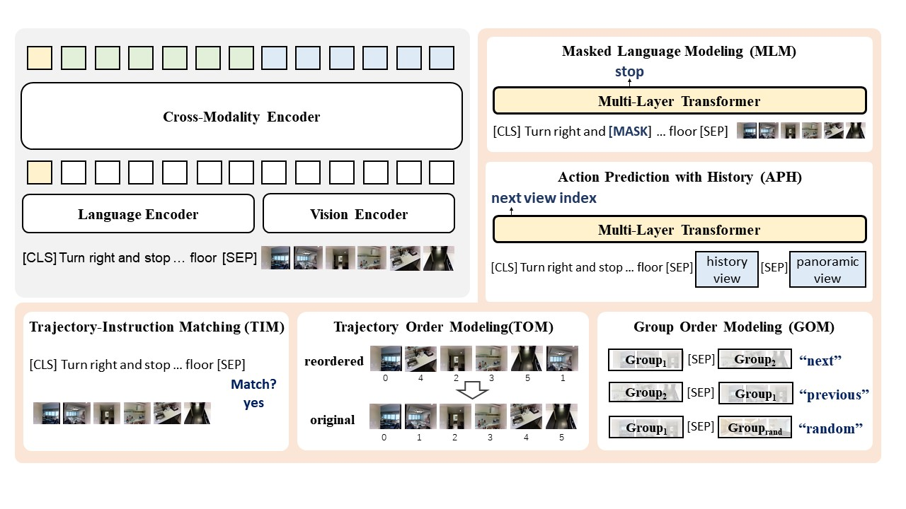

# HOP: History-and-Order Aware Pre-training for Vision-and-Language Navigation

This repository is the official implementation of [HOP: History-and-Order Aware Pre-training for Vision-and-Language Navigation](https://arxiv.org/abs/2203.11591). 



## Prerequisites
```sh
# Set up with Anaconda
conda env create -f hop_env.yaml
conda activate hop
```
## Quick Start
1. Download processed data and pretrained models.
   Please check [here](https://github.com/YanyuanQiao/HOP-VLN/tree/main/data) to download processed data.
2. Run Pre-training
   ```sh
   bash run/pretrain.bash
   ```
   The trained model will be saved under `result/`.
   
3. Run finetuning
   * Please check [here](https://github.com/YanyuanQiao/HOP-VLN) for experiment setup and HOP application.
   The link of finetune is coming soon!

